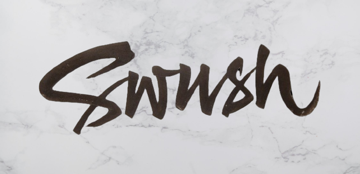

<!-- https://cdn.dribbble.com/users/240981/screenshots/2329287/swush.jpg -->

<h2 align="center">A secure vault for teams</h2>

There are many password managers available. But their common weak point is
the master password. In a developer circle, where team members keep joining and
leaving projects, it can become cumbersome for the remaining team members to
remember the new master password after a member left.

We propose to use the GPG keyring technology instead of a master password to
unlock the vault. Using our application, the use of master passwords is
completely mitigated.

Users can create teams for storing confidential information 
( ssh keys, passwords, oauth tokens, files) related to their projects.

All secret information will be encrypted using the public keys of all 
the team members and stored in the team vault.

The information is decrypted using team member's private key.

Link to the [Demo Video](https://coepac-my.sharepoint.com/:v:/g/personal/correasn18_comp_coep_ac_in/Eai2vgXbFm1MjDmhDnNiH3QBEVFXASAcCudnbHIhXyofxw?e=d1SVgs).
